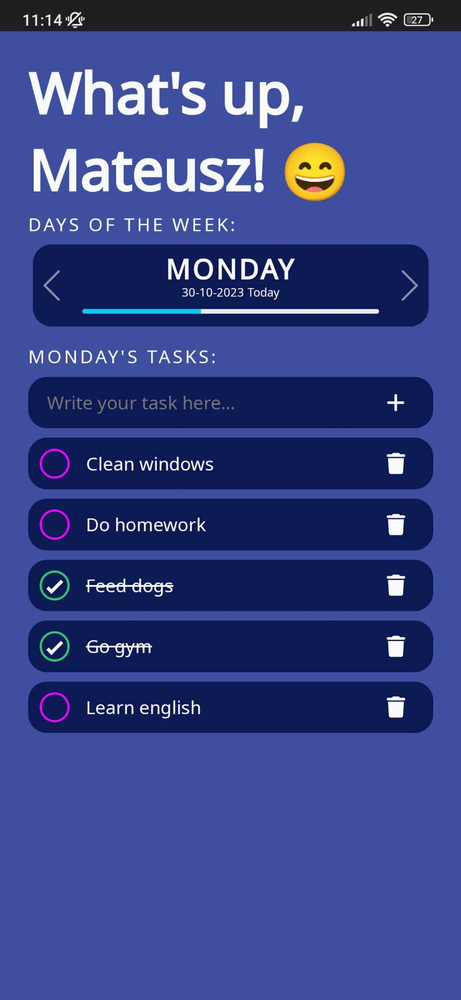

# TodoApp

An application for managing tasks for a given week. I was looking for an app that would allow me to add, delete, edit, and mark tasks as completed for a specific day in a straightforward manner. The idea was to plan tasks for the entire upcoming week on Sundays. The application was meant to be simple, without unnecessary features, and accessible on Android devices. I decided to program it myself.

Requirements:
* Ability to add, edit, and delete tasks.
* Tasks can be added for a specific day of the week.
* Tasks are displayed for the current day and up to a week ahead.
* Ability to undo task deletion, for example, in case of accidental removal,
* A mobile application for Android devices.

The application was created solely for my personal use, so I do not allow the possibility of registration and usage by third parties.

Link: https://monastyr-todo.web.app

-------------------------------
### Login page | Main dashboard | Application overview

  
  
  

